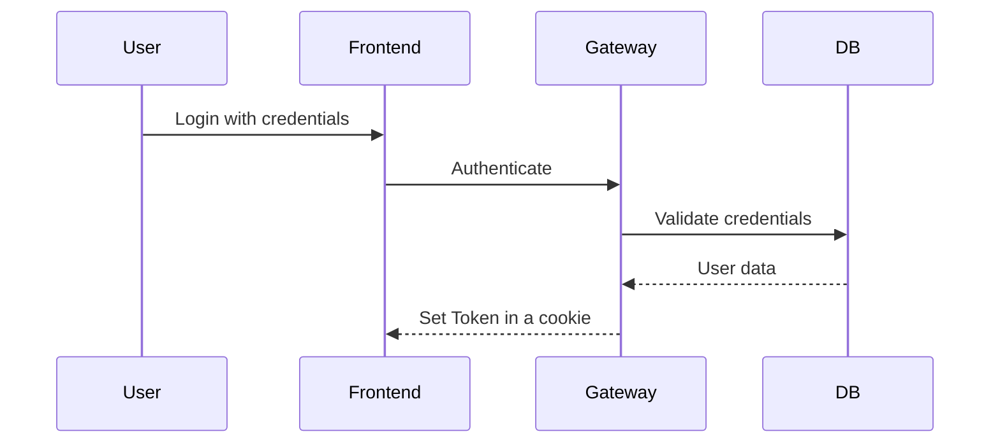
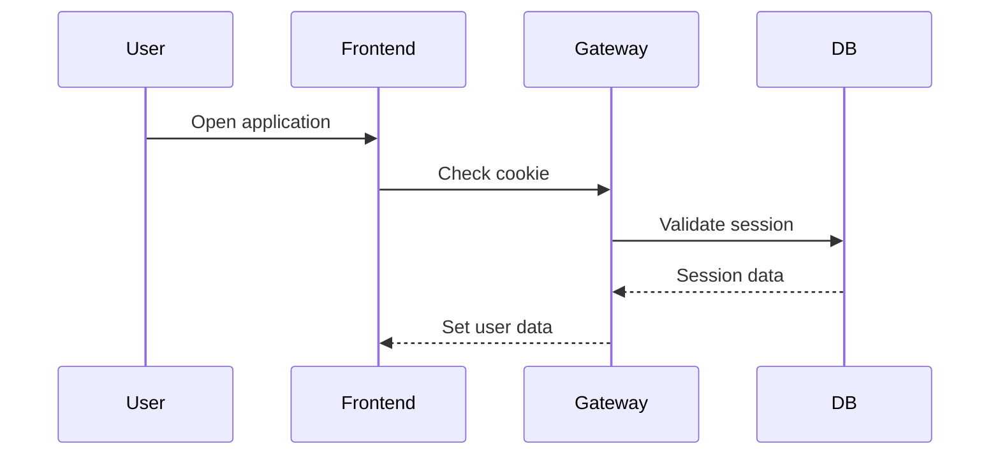
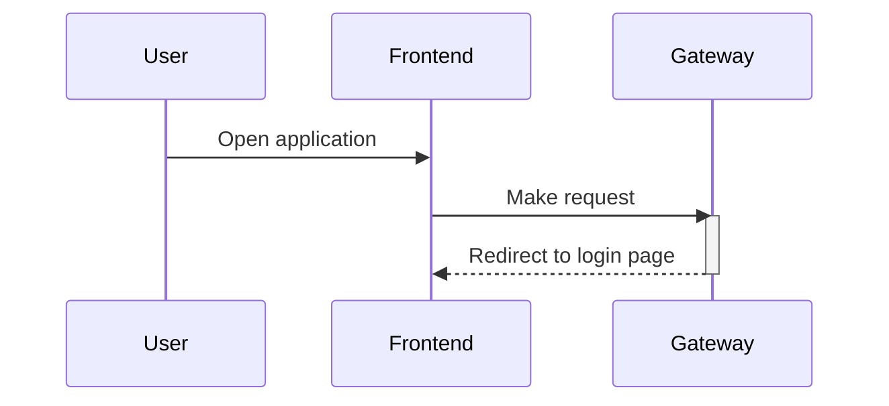
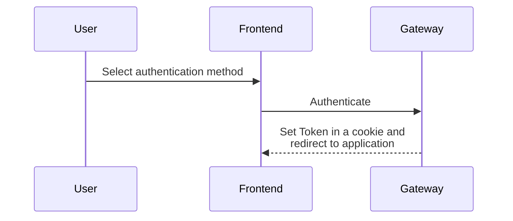

# 2. login-workflow

Date: 2025-04-26

## Status

Accepted

## Context

The authentication methods need to keep the session alive, so that the user can be authenticated in the frontend application.

## Decision

### Login workflow

The login workflow for Basic authentication will be as follows:



Cookie name is `taronja-session`, and it will be set with the `HttpOnly` and `Secure` flags.

Session will be stored in the database, and the token will be a JWT token, stating the user id and the expiration date.
The expiration date will be set to 1 hour, and the session will be renewed every time the user makes a request to the gateway.

On each request, the gateway will check if the token is valid and not expired. The user will be checked in the database, and if the user is not found, deactivated, or expired, the user will be logged out.

The user will be logged out by deleting the session from the database and removing the cookie from the browser.

### User is already authenticated

If the user is already authenticated, the frontend will check if the cookie is set and it is valid. If the cookie is valid, the user will be logged in automatically.



### User is not authenticated

If the user is not authenticated, the frontend will redirect the user to the login page. Then the user can select any of the enabled authentication methods.



### User login page



### User table

```sql
CREATE TABLE user (
    id SERIAL PRIMARY KEY,
    username VARCHAR(255) NOT NULL UNIQUE,
    password VARCHAR(255) NOT NULL,
    created_at TIMESTAMP DEFAULT NOW(),
    updated_at TIMESTAMP DEFAULT NOW(),
    active BOOLEAN DEFAULT TRUE
);
```

Password will be hashed using argon2id.

Using the parameters recommended by the [OWASP Password Storage Cheat Sheet](https://cheatsheetseries.owasp.org/cheatsheets/Password_Storage_Cheat_Sheet.html#argon2).

*"Use Argon2id with a minimum configuration of 19 MiB of memory, an iteration count of 2, and 1 degree of parallelism."*


### Session table

```sql
CREATE TABLE session (
    id SERIAL PRIMARY KEY,
    user_id INTEGER NOT NULL,
    token VARCHAR(255) NOT NULL UNIQUE,
    expires_at TIMESTAMP NOT NULL,
    created_at TIMESTAMP DEFAULT NOW(),
    updated_at TIMESTAMP DEFAULT NOW(),
    FOREIGN KEY (user_id) REFERENCES users(id)
);
```

## Consequences

Keep the user logged in for a period of time, so that the user can access the application without having to login again.
